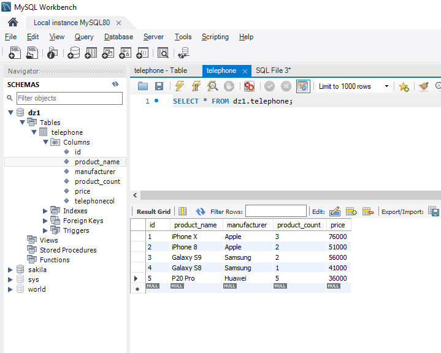
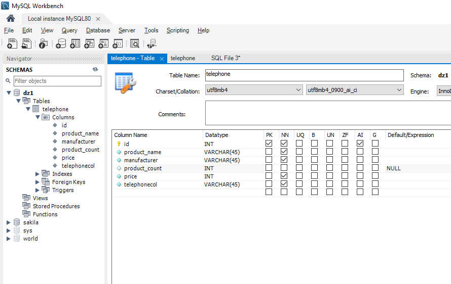

__Создайте таблицу с мобильными телефонами (mobile_phones), используя графический интерфейс. Заполните БД данными. Добавьте скриншот на платформу в качестве ответа на ДЗ__

--Выведите название, производителя и цену для товаров, количество которых превышает 2

-- SELECT product_name, manufacturer, price FROM telephone
-- WHERE product_count  > 2;

-- Выведите весь ассортимент товаров марки “Samsung”

-- Если ассортимент - это наименование модели, то вот так)) если нет то *
-- SELECT product_name FROM telephone
-- WHERE manufacturer = "Samsung";

-- Товары, в которых есть упоминание "Iphone"

-- SELECT * FROM telephone
-- WHERE product_name LIKE 'Iphone %%%'

-- Товары, в которых есть упоминание "Samsung"

-- SELECT * FROM telephone
-- WHERE manufacturer LIKE 'Samsung'

--Товары, в которых есть ЦИФРЫ (тут не вывелось)

SELECT * FROM telephone
WHERE product_name LIKE '%[^0-9]%'