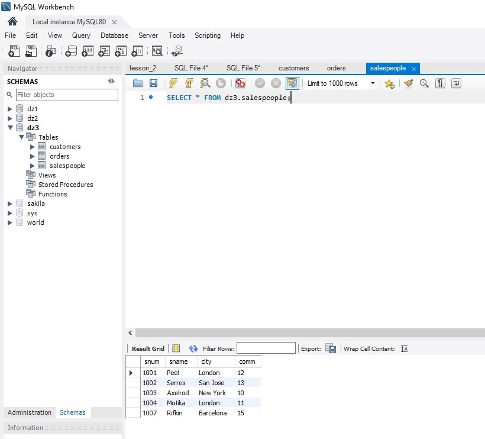
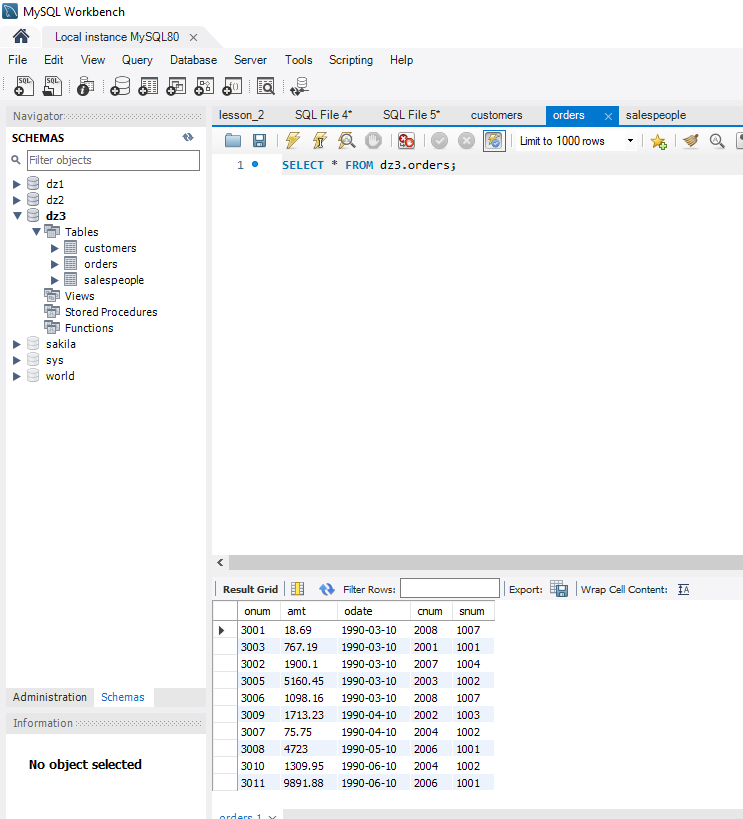
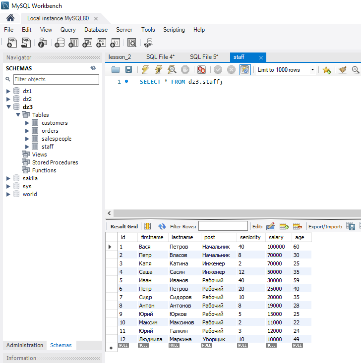

CREATE SCHEMA `dz3` ;

use dz3;
create table SALESPEOPLE(
snum int,
sname varchar(20),
city varchar(20),
comm int not null
);

INSERT INTO SALESPEOPLE(snum,sname,city,comm)
VALUES 
(1001, 'Peel', 'London', 12),
(1002, 'Serres', 'San Jose', 13),
(1004, 'Motika', 'London', 11),
(1007, 'Rifkin', 'Barcelona', 15),
(1003, 'Axelrod', 'New York', 10);

create table CUSTOMERS(
cnum int,
cname varchar(20),
city varchar(20),
rating int,
snum int
);

INSERT INTO CUSTOMERS(cnum, cname, city, rating, snum)
VALUES 
(2001, 'Hoffman', 'London', 100, 1001),
(2002, 'Giovanni', 'Rome', 200, 1003),
(2003, 'Liu', 'SanJose', 200, 1002),
(2004, 'Grass', 'Berlin', 300, 1002),
(2006, 'Clemens', 'London', 100, 1001),
(2008, 'Cisneros', 'SanJose', 300, 1007),
(2007, 'Pereira', 'Rome', 100, 1004);

create table ORDERS(
onum int,
amt float,
odate date,
cnum int,
snum int
);

INSERT INTO ORDERS(onum, amt, odate, cnum, snum)
VALUES 
(3001, 18.69, '1990-03-10', 2008, 1007),
(3003, 767.19, '1990-03-10', 2001, 1001),
(3002,1900.10, '1990-03-10',2007, 1004),
(3005, 5160.45, '1990-03-10',2003,1002),
(3006,1098.16, '1990-03-10',2008,1007),
(3009, 1713.23, '1990-04-10',2002,1003),
(3007, 75.75, '1990-04-10',2004,1002),
(3008,4723.00, '1990-05-10', 2006, 1001),
(3010,1309.95, '1990-06-10', 2004, 1002),
(3011, 9891.88, '1990-06-10', 2006, 1001);

-- Напишите запрос, который вывел бы таблицу со столбцами в следующем порядке: city, sname, snum, comm. (к первой или второй таблице, используя SELECT)
select city, sname, snum, comm from SALESPEOPLE;

-- Напишите команду SELECT, которая вывела бы оценку(rating), сопровождаемую именем каждого заказчика в городе San Jose. (“заказчики”)
SELECT cname, rating FROM customers WHERE city = 'SanJose';

-- Напишите запрос, который вывел бы значения snum всех продавцов из таблицы заказов без каких бы то ни было повторений. (уникальные значения в  “snum“ “Продавцы”)
SELECT DISTINCT snum FROM salespeople;

-- Напишите запрос, который бы выбирал заказчиков, чьи имена начинаются с буквы G. Используется оператор "LIKE": (“заказчики”) https://dev.mysql.com/doc/refman/8.0/en/string-comparison-functions.html
SELECT cname FROM customers WHERE cname LIKE 'G%';

-- Напишите запрос, который может дать вам все заказы со значениями суммы выше чем $1,000. (“Заказы”, “amt”  - сумма)
SELECT amt FROM orders2 WHERE amt > 1000;

-- Напишите запрос который выбрал бы наименьшую сумму заказа. (Из поля “amt” - сумма в таблице “Заказы” выбрать наименьшее значение)
SELECT amt FROM orders2 ORDER BY amt LIMIT 1;

-- Напишите запрос к таблице “Заказчики”, который может показать всех заказчиков, у которых рейтинг больше 100 и они находятся не в Риме.
SELECT * FROM customers WHERE rating > 100 AND city!= 'Rome';

-- --------------------------------------------------------------------

CREATE TABLE staff (
id INT AUTO_INCREMENT PRIMARY KEY,
firstname VARCHAR(45),
lastname VARCHAR(45),
post VARCHAR(100),
seniority INT,
salary INT,
age INT
);

-- Наполнение данными
INSERT INTO staff (firstname, lastname, post, seniority, salary, age)
VALUES
('Вася', 'Петров', 'Начальник', '40', 100000, 60),
('Петр', 'Власов', 'Начальник', '8', 70000, 30),
('Катя', 'Катина', 'Инженер', '2', 70000, 25),
('Саша', 'Сасин', 'Инженер', '12', 50000, 35),
('Иван', 'Иванов', 'Рабочий', '40', 30000, 59),
('Петр', 'Петров', 'Рабочий', '20', 25000, 40),
('Сидр', 'Сидоров', 'Рабочий', '10', 20000, 35),
('Антон', 'Антонов', 'Рабочий', '8', 19000, 28),
('Юрий', 'Юрков', 'Рабочий', '5', 15000, 25),
('Максим', 'Максимов', 'Рабочий', '2', 11000, 22),
('Юрий', 'Галкин', 'Рабочий', '3', 12000, 24),
('Людмила', 'Маркина', 'Уборщик', '10', 10000, 49);

-- Отсортируйте поле “зарплата” в порядке убывания и возрастания
SELECT * FROM staff ORDER BY salary;

-- Отсортируйте по возрастанию поле “Зарплата” и выведите 5 строк с наибольшей заработной платой (возможен подзапрос)
SELECT * FROM staff ORDER BY salary DESC;
SELECT * FROM staff ORDER BY salary DESC LIMIT 5;

-- Выполните группировку всех сотрудников по специальности , суммарная зарплата которых превышает 100000
SELECT post FROM staff GROUP BY post HAVING SUM(salary) > 100000;

