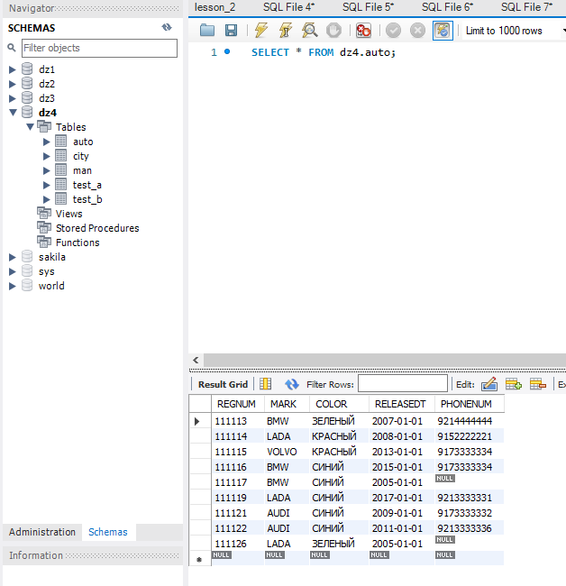
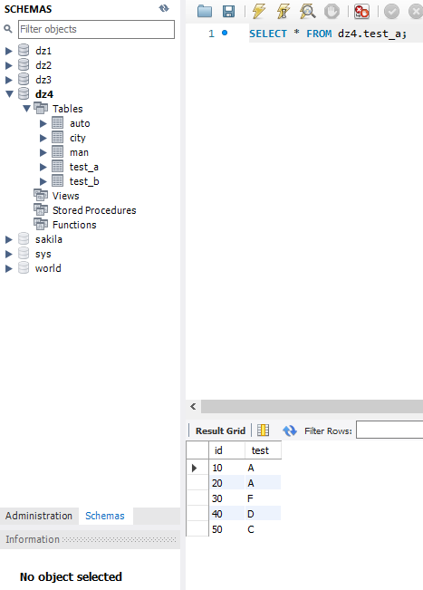
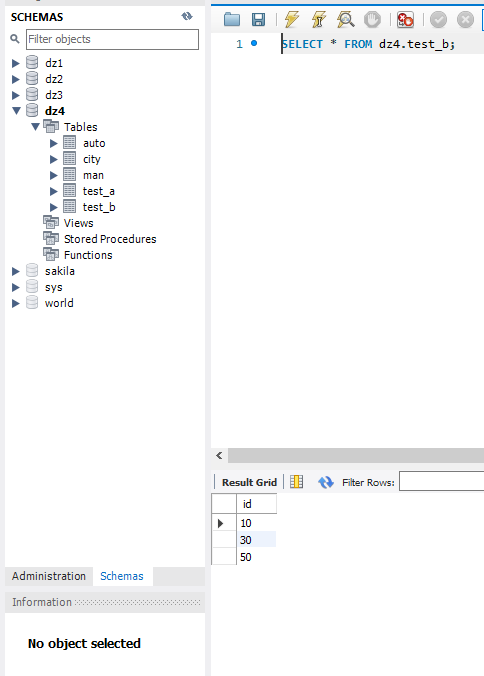

-- 1. Вывести на экран, сколько машин каждого цвета  для машин марок BMW и LADA
SELECT MARK, color, COUNT(color) AS 'Количество автомобилей' FROM AUTO
WHERE MARK = 'LADA'
GROUP BY color, mark 
UNION SELECT MARK, color, COUNT(color) AS 'Количество автомобилей' FROM AUTO
WHERE MARK = 'BMW'
GROUP BY color, mark;

-- 2. Вывести на экран марку авто(количество) и количество авто не этой марки.
SELECT MARK, (COUNT(color) - 1) AS 'Количество автомобилей' FROM AUTO
GROUP BY MARK;

-- запрос, который вернет строки из таблицы test_a, id которых нет в таблице test_b, НЕ используя ключевого слова NOT.
SELECT * FROM test_a
NATURAL LEFT JOIN test_b
WHERE test_b.id IS NULL;

